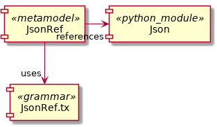

# Multi-metamodel examples (textX)

## Overview

Here, we present some DSLs consisting of multiple metamodels.

### [multimetamodel01_shared_grammar](multimetamodel01_shared_grammar)

**One python project** defines three metamodels based on three
grammars (including each other).

The **Types DSL** defines types (like an int). 
The **Data DSL** defines data structures 
(containing attributes based on the Types DSL).
The **Flow DSL** defines Algorithms with inputs/outputs
based on the Data DSL. It also allows to connect 
algorithms (matching structure types are checked).

An example model file "types.type":

    type int
    type string

An example model file "data_structures.data":

    #include "types.type"
    data Point { x: int y: int}
    data City { name: string }
    data Population { count: int}

An example model file "data_flow.flow":

    #include "data_structures.data"
    #include "types.type" // double include, loaded 1x only
    
    algo A1 : Point -> City
    algo A2 : City -> Population
    connect A1 -> A2

#### Challenges for an Editor

 * multiple files are included (allow to navigate across files;
   shared grammars).
 * multiple meta models ar used

### [multimetamodel02_separate_packages](multimetamodel02_separate_packages)

**Three python projects** define three metamodels based on three
grammars. The metamodels reference each other.

The same semantics as in the previous section are defined.

#### Challenges for an Editor

 * multiple files are included (allow to navigate across files;
   metamodels reference each other).
 * multiple meta models ar used

### [multimetamodel03_non_textx_models](multimetamodel03_non_textx_models)

A textx model references a json object.
 

#### Challenges for an Editor

 * non-textx files are included (json file).
 * non-textx elements are references (OBJECT) from the json file.

## Installation and usage of the DSLs

### Setup the virtual environment

	virtualenv venv -p $(which python3)
	source ./venv/bin/activate
	pip install -r requirements_dev.txt
	pip install multimetamodel01_shared_grammar/
	pip install multimetamodel02_separate_packages/types_dsl/
	pip install multimetamodel02_separate_packages/data_dsl/
	pip install multimetamodel02_separate_packages/flow_dsl/
	pip install multimetamodel02_separate_packages/flow_codegen/
	pip install multimetamodel03_non_textx_models/

### Run the tests 

	py.test multimetamodel01_shared_grammar/tests/
	py.test multimetamodel02_separate_packages/types_dsl/tests
	py.test multimetamodel02_separate_packages/data_dsl/tests
	py.test multimetamodel02_separate_packages/flow_dsl/tests
	py.test multimetamodel02_separate_packages/flow_codegen/tests
	py.test multimetamodel03_non_textx_models/tests

### Run the executables

Here, you can validate the model used by the tests files interactively.

#### flow_dsl, data_dsl, types_dsl

Here, we have three separate validators, one for each DSL (one is used here).

	cd multimetamodel02_separate_packages/flow_dsl/tests/models/
	flow_dsl_validate *.flow

Expected outcome

	validating data_flow.flow
	validating data_flow_including_error.flow
	  WARNING/ERROR: /home/pierre/checkouts/textX-LS/examples/multimetamodel01_shared_grammar/tests/models/types_with_error.type:1:1: error: types must be lowercase
	validating data_flow_with_error.flow
	  WARNING/ERROR: data_flow_with_error.flow:5:1: error: algo data types must match

#### flow_dsl code generator

	cd multimetamodel02_separate_packages/flow_codegen/tests/models/
	flow_dsl_codegen data_flow.flow
	plantuml data_flow.flow.pu # optional

Expected outcome

	validating data_flow.flow
	validating data_flow_including_error.flow
	  WARNING/ERROR: /home/pierre/checkouts/textX-LS/examples/multimetamodel01_shared_grammar/tests/models/types_with_error.type:1:1: error: types must be lowercase
	validating data_flow_with_error.flow
	  WARNING/ERROR: data_flow_with_error.flow:5:1: error: algo data types must match
	
#### types_data_flow_dsls

Here, we have one validator for all DSLs (metamodel selected by filename suffix).

	cd multimetamodel01_shared_grammar/tests/models/
	types_data_flow_dsls_validate *.*

Expected outcome

	validating data_flow.flow
	validating data_flow_including_error.flow
	  WARNING/ERROR: /home/pierre/checkouts/textX-LS/examples/multimetamodel01_shared_grammar/tests/models/types_with_error.type:1:1: error: types must be lowercase
	validating data_flow_with_error.flow
	  WARNING/ERROR: data_flow_with_error.flow:5:1: error: algo data types must match
	validating data_structures.data
	validating data_structures_including_error.data
	  WARNING/ERROR: /home/pierre/checkouts/textX-LS/examples/multimetamodel01_shared_grammar/tests/models/types_with_error.type:1:1: error: types must be lowercase
	validating types.type
	validating types_with_error.type
	  WARNING/ERROR: types_with_error.type:1:1: error: types must be lowercase

#### json_ref_dsl

We can validate if all references to a json file from a textx model are ok:

	cd multimetamodel03_non_textx_models/tests/models
	json_ref_dsl_validate ok.jref 

Expected output:

	validating ok.jref
	A1 --> pierre: ok
	A2 --> male: ok
