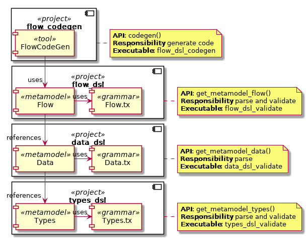
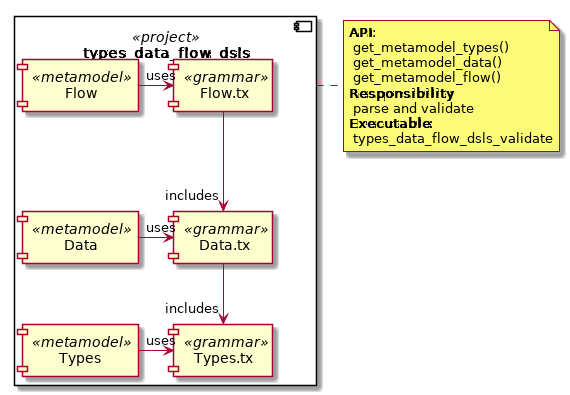
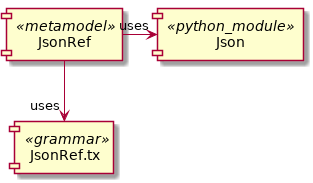

# Multi-metamodel examples (textX)

## Overview

Here, we present some DSLs consisting of multiple metamodels.
 * [01_separate_projects](01_separate_projects) - textx metamodels refencing each other.
 * [02_shared_grammar](02_shared_grammar) - textx metamodels based on grammars including each other.
 * [03_non_textx_models](03_non_textx_models) - text metamodel referencing a JSON file.

### [01_separate_projects](01_separate_projects)

**Four separate python projects** define three metamodels based on three
grammars and one code generator project. The metamodels reference each other.

The **Types DSL** defines types (like an int). This is a 
trivial DSL with no depencies to other DSLs.
The **Data DSL** defines data structures 
(containing attributes based on the Types DSL).
The **Flow DSL** defines Algorithms with inputs/outputs
based on the Data DSL. It also allows to connect 
algorithms (matching structure types are checked).

An example model file "types.type":

    type int
    type string

An example model file "data_structures.data":

    #include "types.type"
    data Point { x: int y: int}
    data City { name: string }
    data Population { count: int}

An example model file "data_flow.flow":

    #include "data_structures.data"
    #include "types.type" // double include, loaded 1x only
    
    algo A1 : Point -> City
    algo A2 : City -> Population
    connect A1 -> A2

#### Challenges for an Editor

 * Multiple files are included (allow to navigate across files;
   shared grammars).
 * Multiple meta models are used.
 * Model validation for *.flow and *.types is defined.

### [02_shared_grammar](02_shared_grammar)

**One python project** defines three metamodels based on three
grammars (including each other).

 * The same semantics as in the previous section are defined.
 * A code generator is defined.

#### Challenges for an Editor

 * Multiple files are included (allow to navigate across files;
   metamodels reference each other).
 * Multiple meta models ar used
 * Model validation for *.flow and *.types is defined.
 * A code generator is defined.

### [03_non_textx_models](03_non_textx_models)

A textx model references a JSON object.
 

#### Challenges for an Editor

 * Non-textx files are included (json file).
 * Non-textx elements are references (OBJECT) from the json file.
 * Model validation is defined.

## Installation and usage of the DSLs

After setting up the virtual env you can do the following: 

    egrep "# build\s*$" README.md | sed -r 's/# build/|| exit 1/' > temp.sh
    # Have a look at temp.sh before executing...
    bash temp.sh

### Setup the virtual environment

	virtualenv venv -p $(which python3) # build
	source ./venv/bin/activate # build

### Install all example projects

	pip install -r requirements_dev.txt               # build 
	pip install 01_separate_projects/types_dsl/     # build
	pip install 01_separate_projects/data_dsl/      # build
	pip install 01_separate_projects/flow_dsl/      # build
	pip install 01_separate_projects/flow_codegen/  # build
	pip install 02_shared_grammar/                  # build
	pip install 03_non_textx_models/                # build

### Run the tests 

	py.test 01_separate_projects/types_dsl/tests       # build
	py.test 01_separate_projects/data_dsl/tests        # build
	py.test 01_separate_projects/flow_dsl/tests        # build
	py.test 01_separate_projects/flow_codegen/tests    # build
	py.test 02_shared_grammar/tests/                   # build
	py.test 03_non_textx_models/tests                  # build

### Run the executables

Here, you can validate the model used by the tests files interactively.

#### flow_dsl, data_dsl, types_dsl

Here, we have three separate validators, one for each DSL (one is used here).

	cd 01_separate_projects/flow_dsl/tests/models/
	flow_dsl_validate *.flow

Expected outcome

	validating data_flow.flow
	validating data_flow_including_error.flow
	  WARNING/ERROR: /home/pierre/checkouts/textX-LS/examples/02_shared_grammar/tests/models/types_with_error.type:1:1: error: types must be lowercase
	validating data_flow_with_error.flow
	  WARNING/ERROR: data_flow_with_error.flow:5:1: error: algo data types must match

#### flow_dsl code generator

	cd 01_separate_projects/flow_codegen/tests/models/
	flow_dsl_codegen data_flow.flow
	plantuml data_flow.flow.pu # optional

Expected outcome

	validating data_flow.flow
	validating data_flow_including_error.flow
	  WARNING/ERROR: /home/pierre/checkouts/textX-LS/examples/02_shared_grammar/tests/models/types_with_error.type:1:1: error: types must be lowercase
	validating data_flow_with_error.flow
	  WARNING/ERROR: data_flow_with_error.flow:5:1: error: algo data types must match
	
#### types_data_flow_dsls

Here, we have one validator for all DSLs (metamodel selected by filename suffix).

	cd 02_shared_grammar/tests/models/
	types_data_flow_dsls_validate *.*

Expected outcome

	validating data_flow.flow
	validating data_flow_including_error.flow
	  WARNING/ERROR: /home/pierre/checkouts/textX-LS/examples/02_shared_grammar/tests/models/types_with_error.type:1:1: error: types must be lowercase
	validating data_flow_with_error.flow
	  WARNING/ERROR: data_flow_with_error.flow:5:1: error: algo data types must match
	validating data_structures.data
	validating data_structures_including_error.data
	  WARNING/ERROR: /home/pierre/checkouts/textX-LS/examples/02_shared_grammar/tests/models/types_with_error.type:1:1: error: types must be lowercase
	validating types.type
	validating types_with_error.type
	  WARNING/ERROR: types_with_error.type:1:1: error: types must be lowercase

#### json_ref_dsl

We can validate if all references to a json file from a textx model are ok:

	cd 03_non_textx_models/tests/models
	json_ref_dsl_validate ok.jref 

Expected output:

	validating ok.jref
	A1 --> pierre: ok
	A2 --> male: ok
